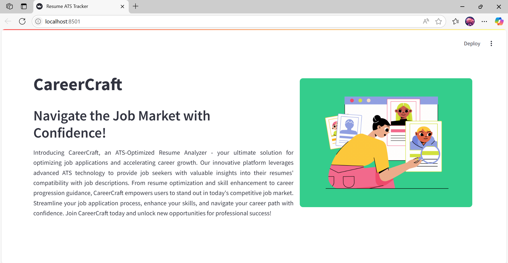
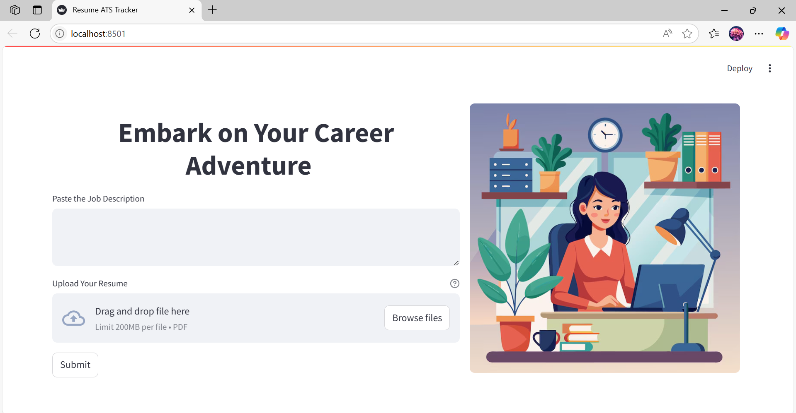
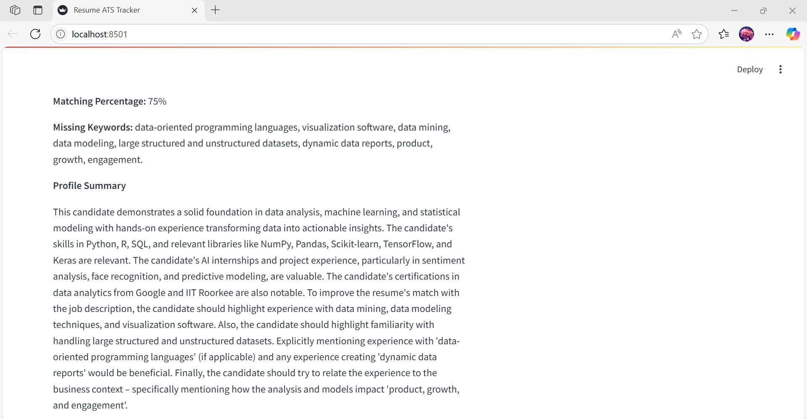
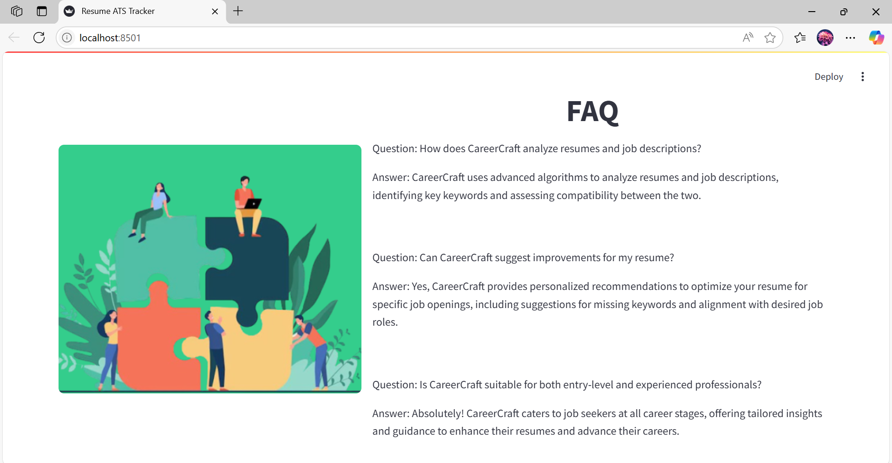

# CareerCraft: ATS-Optimized Resume Analyzer using Gemini Model

🚀 *Navigate the Job Market with Confidence!*

CareerCraft is a Streamlit-based web application that leverages the power of Google’s Gemini Pro model to analyze resumes against job descriptions. It provides intelligent feedback including keyword gaps, match percentages, and personalized profile summaries — all tailored for the modern tech job market.

---

## 📽 Project Demonstration

Watch the full demo below to see how CareerCraft works in real time:

[](https://www.youtube.com/watch?v=E0cgbWYTR9k)

---

## 🧠 Features

- ✅ ATS-Optimized Resume Matching
- ✅ Gemini-powered AI Analysis
- ✅ Keyword Gap Identification
- ✅ Personalized Profile Summaries
- ✅ Supports 20+ Technical Job Roles
- ✅ Clean UI with Streamlit
- ✅ Resume Parsing from PDF

---

## 📂 Project Structure

```bash
CareerCraft-ATS-Optimized-Resume-Analyzer-using-Gemini-Model/
│
├── app.py                   # Main Streamlit app
├── .env                    # Stores API key for Google Gemini
├── requirements.txt        # Dependencies
├── images/                 # Icons and UI assets
│   ├── icon1.png
│   ├── icon2.jpg
│   └── icon3.png
├── README.md               # Project documentation
```

---

## ⚙️ How It Works
1. Upload your resume in PDF format.

2. Paste the job description into the provided text area.

3. Click Submit — Gemini analyzes and returns:

- ✅ Match Percentage

- ✅ Missing Keywords

- ✅ Custom Profile Summary

---

## 🚀 Getting Started

### 1. Clone the Repository

```bash
git clone https://github.com/ptrishita/CareerCraft-ATS-Optimized-Resume-Analyzer-using-Gemini-Model.git
cd CareerCraft-ATS-Optimized-Resume-Analyzer-using-Gemini-Model
```

### 2. Install Dependencies

```bash
pip install -r requirements.txt
```

### 3. Add Your Google API Key

- Create a .env file in the project root with:

```bash
GOOGLE_API_KEY=your_google_generative_ai_api_key
```

### 4. Run the Application

```bash
streamlit run app.py
```

---

## 📸 Screenshots







---

## 🛠 Technologies Used

- Streamlit
- Google Gemini Pro (via google-generativeai)
- Python (3.9+)
- PyPDF2
- PIL
- dotenv
- streamlit-extras

---

## 🔮 Future Enhancements

- Support for DOCX and TXT formats
- Real-time keyword recommendations
- Interview preparation module
- LinkedIn profile integration

---

## 🙌 Contributing
Pull requests are welcome! If you'd like to contribute, please fork the repository and use a feature branch. Issues and suggestions are also appreciated.

---

## 📬 Contact
For queries or suggestions, feel free to reach out at [**trishitapaul5@gmail.com**](mailto:trishitapaul5@gmail.com).
